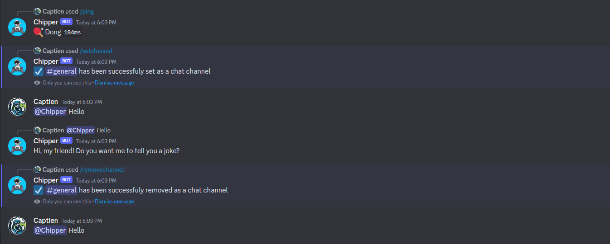
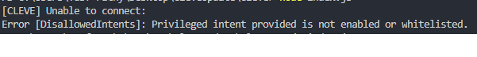

<h1 align="center">
   Cleve
</h1>
<h3 align="center">A basic discord chatbot created with Discord.js v14 & powered by Brainshop.ai</h3>
<p align="center">

<a href="https://github.com/Carbowix/Cleve/blob/master/LICENSE">
   
</a>
<a href="https://nodejs.org/en/download/">
   
</a>
<a href="https://github.com/discordjs/discord.js/">
   
</a>
<a href="https://github.com/Carbowix/Cleve">
   
</a>
<br>
<a href="https://discord.gg/nntu7rgxtP">

</a>
</p>


## Installation & Setup
- [Node.js v16.9+](https://nodejs.org/en/download) is required to download.
- Download & extract the files either by `git clone https://github.com/Carbowix/Cleve.git` or by simply [downloading](https://github.com/Carbowix/Cleve/archive/refs/heads/master.zip)
- Open your command prompt and be sure you are on the right root directory by using [cd](https://www.lifewire.com/change-directories-in-command-prompt-5185508) command.
- Once you are sure, proceed with `npm install` or `yarn install` command to install latest packages.

### Creating a brainshop.ai account bot
- Register an account at [brainshop.ai](http://brainshop.ai/user/register)
- Once registered and logged-in, Press **create a brain** -> **root brain**
- Enter your custom bot name and make sure details match the following:


- Once finished, edit [src/misc/config.json](https://github.com/Carbowix/Cleve/blob/master/src/misc/config.json) with the corresponding data given: 


>**NOTE**: Don't edit **"url"**

### Adding discord bot details:
- Create a discord bot [application](https://discordjs.guide/preparations/setting-up-a-bot-application.html#your-bot-s-token).
- Once finished, edit [src/misc/config.json](https://github.com/Carbowix/Cleve/blob/master/src/misc/config.json) file at the **"bot_token"** parameter to insert your [BOT_TOKEN](https://www.writebots.com/discord-bot-token/).

>**NOTE**: If you are running this bot on replit, Make sure to rename `.env.example` to `.env` and insert your discord bot token to "BOT_TOKEN="


- Once you are done, run `npm run start` or `yarn run start` on the command prompt and it should be ready to talk!.
```bash
[CLEVE] Loaded 3 commands
[CLEVE] Ready to chat!
```

- Mention it, and start talking!


## Available Features
- Slash commands that helps you ease your bot management
- Set/Remove default chat text channels for the bot. (Supports multiple channels)


- Ping command to ensure bot is ready to knock on your door.
- No mention feature so that bot can talk without being mentioned. (**Check** [here](#how-to-enable-no-mention-feature) for more details)
- Direct messages chatting is now available through configuration. (**Check** [here](#how-to-enable-direct-messages-feature) for more details)

## Issues
If you have any issues feel free to create one in the issues [section](https://github.com/Carbowix/Cleve/issues). Make sure that your issue wasn't listed in the [closed](https://github.com/Carbowix/Cleve/issues?q=is%3Aissue+is%3Aclosed) issues before creating an issue.

## Frequently Asked Questions (FAQ)
### How to enable No mention feature
Head to [src/misc/config.json](https://github.com/Carbowix/Cleve/blob/master/src/misc/config.json) and edit **"noMention"** value to `true`

- **IMPORANT**: In-order for this feature to work, you will have to enable [MessageContent Privileged Intent](https://autocode.com/discord/threads/what-are-discord-privileged-intents-and-how-do-i-enable-them-tutorial-0c3f9977/) in your discord bot application. Otherwise it will produce and error like the following:


### How to enable Direct Messages feature
Head to [src/misc/config.json](https://github.com/Carbowix/Cleve/blob/master/src/misc/config.json) and edit **"noMention"** value to `true`

### Bot not replying / API error
It most likely either you failed to to follow the [installation](#installation--setup) instructions correctly or Brainshop.ai API is [down](https://rapidapi.com/Acobot/api/brainshop-ai/discussions)

### Invalid Token even when loaded though .env file
It is most likely the `.env` file is either still named `.env.example` which you should change to `.env` or the file is not in the `src` folder.
Otherwise your bot token is actually invalid.

## Credits
- Thanks [BrainshopAI](http://brainshop.ai/) for providing free/fast clever bot API
